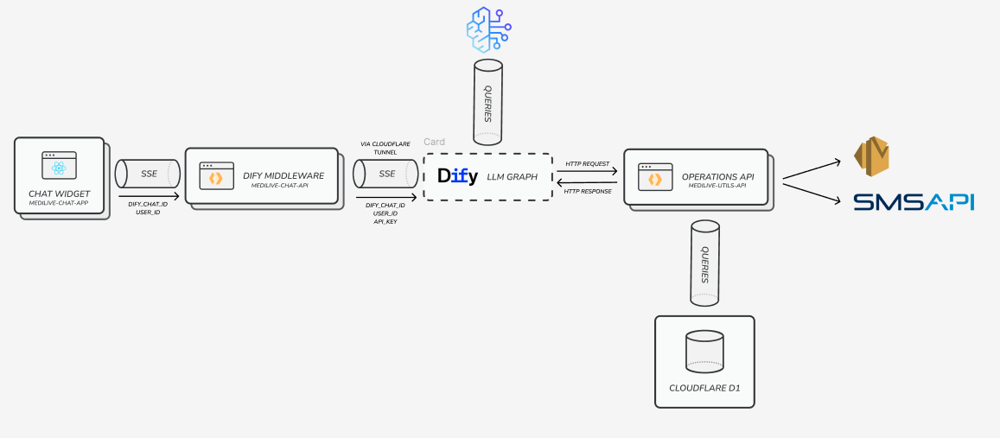

# MediLive — AI Chat Platform for medical clinics

## Overview

MediLive is an AI chat platform purpose-built for Polish medical
clinics. It ships as a set of three packages that together deliver:

- A **configurable, embeddable React chat widget** that streams AI responses
  directly from a clinic's [Dify](https://dify.ai) workflow,
- A **thin proxy layer** (Cloudflare Workers) that handles SSE streaming, JWT
  session management, and per-tenant API-key resolution - so the frontend never
  talks to Dify with hard-coded secrets,
- A **utility API** for transactional email (Amazon SES), SMS reminders
  (smsapi.pl), and visit/appointment persistence (Cloudflare D1).

Every clinic gets its own Dify workflow, branding, and optionally its own set of
utility endpoints - the platform is designed so that new tenants can be onboarded
with only configuration and zero code changes.

The Dify chat workflow powering the platform handles the following
capabilities out of the box:

- **Prompt safety** — detects malicious inputs (anti-prompt-injection,
  anti-jailbreak, anti-code-injection, bad URLs & PII)
- **Emergency detection** — identifies emergency cases and escalates
  appropriately
- **Visit scheduling** — creates and books medical appointments
- **Small talk** — handles casual conversation naturally
- **Triage & doctor matching** — evaluates symptoms and matches patients
  to the right doctor
- **Offer presentation** — presents clinic service offers
- **Staff presentation** — introduces clinic personnel
- **Examination preparation** — helps patients prepare for medical
  examinations
- **Prevention methods** — presents preventive care recommendations

---

## Tech Stack

| Layer | Technology | Purpose |
|---|---|---|
| **Frontend** | React 19, Vite 8, Tailwind CSS 4, shadcn/ui | Chat widget SPA |
| **AI Streaming** | Vercel AI SDK v6 (`@ai-sdk/react`, `ai`) | Streaming chat transport & UI hooks |
| **Markdown** | react-markdown, remark-gfm, Shiki | Rich message rendering with syntax highlighting |
| **Proxy API** | Hono 4, Cloudflare Workers, eventsource-parser | SSE streaming proxy, JWT auth, rate limiting |
| **Utility API** | Hono 4, Cloudflare Workers, Nodemailer, smsapi.pl | Email, SMS, visit persistence |
| **Database** | Cloudflare D1 (SQLite) | Visits, institutions, doctors |
| **KV Storage** | Cloudflare Workers KV | API keys, rate limit counters, workflow credentials |
| **Security** | Cloudflare Turnstile, JWT (HS256) | Bot protection, stateless session management |
| **Package Manager** | pnpm ≥ 9 | Monorepo dependency management |

---

## Project Structure

```
medilive-front/
├── medilive-chat-app/       # React SPA — embeddable AI chat widget
│   ├── src/
│   │   ├── components/      # ChatWidget, ChatHeader, MessageList, ChatInput, …
│   │   ├── hooks/           # useChatWidget (wraps @ai-sdk/react useChat)
│   │   ├── lib/             # utils, cn, markdown config
│   │   └── routes/          # ChatPage, VisitPage (react-router-dom)
│   ├── .example.env         # Env var template (VITE_WORKER_API_URL, …)
│   └── vite.config.ts
│
├── medilive-chat-api/       # Cloudflare Worker — Dify SSE proxy
│   ├── src/
│   │   ├── index.ts         # Hono app, CORS, /send-message endpoint
│   │   ├── dify/            # Dify client, SSE-to-data-stream transform
│   │   ├── auth/            # JWT minting/verification, Turnstile validation
│   │   └── rate-limit/      # Burst + daily rate limiting
│   ├── wrangler.jsonc       # KV bindings, rate limiter config
│   └── test/                # Vitest tests
│
├── medilive-utils-api/      # Cloudflare Worker — email, SMS, visits
│   ├── src/
│   │   ├── index.ts         # Hono app, API-key auth middleware
│   │   ├── routes/          # /mail, /sms, /visits endpoints
│   │   └── services/        # Nodemailer, smsapi.pl, D1 queries
│   ├── migrations/          # D1 SQL migrations (0001_…, 0002_…, 0003_…)
│   ├── scripts/             # seed-novamed-apikey.ts (reference)
│   └── wrangler.jsonc
│
├── docs/
│   └── arch_diagram.png     # Architecture diagram
│
└── README.md
```

---

## Architecture Diagram



&nbsp;

---

## Package Breakdown

### 1. `medilive-chat-app` - React Chat Widget

**Runtime:** browser (SPA, bundled with Vite)  
**Key libraries:** React 19, [Vercel AI SDK](https://sdk.vercel.ai) v6,
[prompt-kit](https://prompt-kit.com), [shadcn/ui](https://ui.shadcn.com),
Tailwind CSS 4

#### Concept

The widget is a single `<ChatWidget>` component that can be dropped into any
React host application or shared as iFrame. It handles the full messaging lifecycle:

1. User types a question → sent to the **chat-api** Worker via
   `DefaultChatTransport` (Vercel AI SDK v6 data-stream protocol).
2. Each SSE chunk is rendered as a **streaming text-delta** - the answer appears
   token-by-token.
3. On the **very first token** of a new conversation the Worker returns a
   cryptographically signed JWT (embedded in a custom `data-chat-credentials`
   part). The widget persists it in `localStorage` and attaches it to every
   subsequent request, so the Worker can resume the Dify conversation.
4. A "New Chat" button clears the JWT, resets the conversation, and starts
   fresh.

#### White-Label / Multi-Tenant Design

**Onboarding a new clinic** means:
- Creating a new Dify workflow,
- Storing its API key in the Workers KV under the workflow ID,
- Passing the clinic's branding props to `<ChatWidget>`,
- Setting `VITE_DIFY_WORKFLOW_ID` at build time (or providing it per instance).

The widget is **not** hard-coded to any specific clinic - NovaMed is just one
reference deployment.

#### Component Map

```
App.tsx
 └── Routes (react-router-dom)
      ├── "/" ──▶ ChatPage
      │            └── ChatWidget.tsx
      │                 ├── ChatHeader.tsx          ← botName, botAvatar, new-chat button
      │                 ├── WelcomeScreen.tsx       ← prompt suggestions, start-chat callback
      │                 ├── MessageList.tsx         ← rendered message bubbles + visit card
      │                 │     ├── ui/message.tsx
      │                 │     │     └── ui/markdown.tsx   ← react-markdown + remark-gfm + shiki
      │                 │     │     └── ui/code-block.tsx  ← syntax-highlighted code blocks
      │                 │     └── Visit card           ← "Kliknij, aby umowic wizyte" (animated)
      │                 ├── ChatInput.tsx           ← prompt-input (prompt-kit), send/stop
      │                 ├── PromptSuggestions.tsx   ← clickable suggestion chips
      │                 └── PoweredBy.tsx           ← footer logo
      └── "/wizyty/:visitId" ──▶ VisitPage.tsx      ← confirmation page with visit ID
```

State is driven by `useChatWidget()` (custom hook wrapping `useChat` from
`@ai-sdk/react`)

#### Environment Variables

| Variable | Required | Purpose |
|---|---|---|
| `VITE_WORKER_API_URL` | yes | Base URL of the **chat-api** Worker (e.g. `https://chat.medilive.pl`). |
| `VITE_DIFY_WORKFLOW_ID` | yes | Dify workflow/app ID for this tenant. |
| `VITE_TURNSTILE_SITEKEY` | no | Cloudflare Turnstile sitekey for bot protection. When set, a challenge is required before the first message is sent. |

---

### 2. `medilive-chat-api` - Streaming Proxy Worker

**Runtime:** Cloudflare Workers  
**Key libraries:** [Hono](https://hono.dev) 4, `eventsource-parser`, Zod

#### Concept

This Worker is the **only** piece of infrastructure that directly communicates
with Dify. It receives a chat request from the widget, resolves the correct Dify
API key, forwards the request, and transforms Dify's SSE stream into the Vercel
AI SDK v6 **Data Stream Protocol** that the frontend understands.


#### Request Flow

1. **Validate body** (`zValidator` + `SendMessageRequestSchema`): expects
   `messages[]`, optional `jwt`, and `dify_workflow_id`.
2. **Resolve API key for the workflow:**
   - First looks up `KEYS_STORE.get(dify_workflow_id)` (Workers KV),
   - Falls back to `DIFY_API_KEY` environment variable.
3. **Decode the JWT** (if present) to extract `conversation_id` and `user_id`
   - this resumes an existing Dify conversation.
4. **Call Dify** `POST /v1/chat-messages` with `response_mode: "streaming"`.
   - Supports Cloudflare Access headers (`CF-Access-Client-Id` /
     `CF-Access-Client-Secret`) when Dify sits behind Zero Trust.
5. **Stream transformation** - Dify's SSE events are parsed with
   `eventsource-parser` and re-emitted in the Vercel AI SDK v6 format:
   - `message` → `text-delta` chunks
   - First token of a new conversation → `data-chat-credentials` (JWT issuance)
   - `node_started` / `node_finished` → `data-node-status` (workflow step indicator)
   - `node_finished` + title `"CREATE_VISIT"` → `data-visit-created` with `visitId`
     parsed from the node's HTTP response body
   - `error` → forwarded as `error` event
6. **The stream is closed** with `finish-step`, `finish`, and the `[DONE]`
   sentinel.

#### JWT Strategy

- The Worker is the **source of truth** for `user_id` and `conversation_id`.
- On the very first response token of a fresh conversation, it mints a JWT
  (HS256, 24 h expiry) containing both IDs and signs it with `SERVER_SECRET`.
- The widget receives it via `onData`, stores it, and attaches it to every
  subsequent request.
- This keeps the frontend **stateless** with regard to Dify internals -
  conversation continuity is fully transparent.

#### CORS

Allowed origins are configured statically

#### Turnstile Bot Protection

When `TURNSTILE_SECRET_KEY` is configured, the chat-api **requires** a valid
Turnstile token on every request:

- The frontend renders an **invisible** widget (`react-turnstile` with
  `appearance="execute"`). On submit, `turnstile.execute()` is called — trusted
  users resolve automatically in the background; suspicious users see a visible
  challenge.
- The obtained token is sent in the request body (`turnstileToken`).
- The Worker POSTs the token to
  `https://challenges.cloudflare.com/turnstile/v0/siteverify`. If the token is
  **missing or invalid**, the request is rejected with `403 Forbidden` **before**
  any Dify tokens are consumed.

Turnstile is optional — when `TURNSTILE_SECRET_KEY` is absent (e.g. local
development), the Worker skips validation entirely and all requests are accepted.

#### Rate Limiting

The Worker enforces a **two-layer rate limiting** strategy on the `/send-message`
endpoint, keyed by client IP (`CF-Connecting-IP`)

| Layer | Mechanism | Limit | Window | Scope |
|---|---|---|---|---|
| 1 — Burst | `RATE_LIMITER` binding ([Cloudflare Rate Limiting](https://developers.cloudflare.com/workers/runtime-apis/rate-limit/)) | 5 requests | 10 seconds | Per Cloudflare edge location |
| 2 — Daily | `RATE_LIMIT_STORE` KV namespace | 50 requests | 24 hours | Global (across all locations) |

When either limit is exceeded, the Worker responds with `429 Too Many Requests`
and a `Retry-After` header (10 s for burst, 86400 s for daily).

**Fail-open:** If the KV backing `RATE_LIMIT_STORE` is temporarily unavailable,
the daily cap is silently skipped — real users are never blocked by
infrastructure issues.

**Configuration** (in `wrangler.jsonc`):

```jsonc
"ratelimits": [
  {
    "name": "RATE_LIMITER",
    "namespace_id": "1001",
    "simple": { "limit": 5, "period": 10 }
  }
],
"kv_namespaces": [
  // … KEYS_STORE …
  { "binding": "RATE_LIMIT_STORE", "id": "<your-kv-id>" }
]
```

#### Environment Variables & Secrets

| Variable | Required | Purpose |
|---|---|---|
| `DIFY_API_URL` | yes | Base URL of the Dify instance (e.g. `https://dify.medilive.pl`). |
| `DIFY_API_KEY` | fallback | Default API key - used if no workflow-specific key is found in KV. |
| `SERVER_SECRET` | yes | HS256 secret for JWT signing/verification. Set as a Cloudflare **secret**. |
| `TURNSTILE_SECRET_KEY` | no | Cloudflare Turnstile secret for server-side token validation. |
| `CF_ACCESS_CLIENT_ID` | no | Cloudflare Access service token ID (when Dify is behind Zero Trust). |
| `CF_ACCESS_CLIENT_SECRET` | no | Cloudflare Access service token secret. |

**KV Namespace:** `KEYS_STORE`
> Maps `dify_workflow_id → Dify API key`. This is how a specific clinic's workflow is associated with its API credentials without hard-coding them in the frontend.

---

### 3. `medilive-utils-api` - Utility API Worker

**Runtime:** Cloudflare Workers  
**Key libraries:** Hono 4, Nodemailer 9, [smsapi.pl](https://smsapi.pl) client,
Zod

#### Concept

A companion Worker that exposes **authenticated** endpoints for email sending,
SMS reminders, and visit/appointment CRUD. It is not called by the chat widget
directly - it serves external systems (clinic management tools, Dify workflows
via HTTP nodes, etc.).

All routes are protected by API-key authentication (`Authorization: Bearer
<key>`). Keys are stored in Workers KV with:
- 30-day expiry,
- Refreshable for up to 1 year from creation,
- Scoped per `tenant_id`.

#### Endpoints

##### Email - `POST /api/v1/mail`

Sends a transactional email through **Amazon SES SMTP** (or any SMTP-compatible
provider). The body accepts a structured content object (`title`, `body`,
`ctaText`, `ctaUrl`) that gets rendered into a responsive HTML template.

**SMTP config** (environment variables / secrets):

| Variable | Purpose |
|---|---|
| `SMTP_HOST` | SMTP server hostname. |
| `SMTP_PORT` | SMTP port (default `587`). |
| `SMTP_USER` | SMTP username. |
| `SMTP_PASS` | SMTP password (set as a Cloudflare **secret**). |

##### SMS - `POST /api/v1/sms`

Sends an SMS reminder for a previously created visit using the **smsapi.pl**
REST API. Includes a built-in deduplication guard: if another visit with the
same phone number exists for this tenant within the last 24 hours, the SMS is
skipped.

**Required secret:** `SMSAPI_TOKEN` - API token for smsapi.pl.

##### Visits - `POST /api/v1/visits`

Persists a visit record to **Cloudflare D1**. The body references:
- `user-id` - end-user UUID,
- `institution-id` - clinic/facility UUID,
- `doctor-id` - doctor UUID,
- `type` - visit type (free-form string),
- `phone-number`, `email` - optional contact fields.

The `tenantId` is extracted from the API key's payload by the auth middleware -
each key is bound to exactly one tenant.

#### API Key System

| Feature | Detail |
|---|---|
| Format | `mlu_<64 hex chars>` |
| Storage | Workers KV (`apikey:mlu_…`) |
| Expiry | 30 days from creation |
| Refresh | Extends expiry by another 30 days (up to 1 year from creation) |
| Revocation | Delete from KV |
| Tenant scoping | Each key carries a `tenant_id` - downstream handlers can isolate data per tenant |

Keys are generated and managed via a [seed script](./medilive-utils-api/scripts/seed-novamed-apikey.ts)
(reference implementation - adapt for each tenant).

#### Database Migrations

Located in `medilive-utils-api/migrations/`:

| Migration | Tables created |
|---|---|
| `0001_create_visits_table` | `visits` - appointment records with tenant isolation |
| `0002_create_institutions_table` | `institutions` - clinic metadata |
| `0003_create_doctors_table` | `doctors` - doctor metadata |

#### Environment Variables & Secrets

| Variable | Required | Purpose |
|---|---|---|
| `SMTP_HOST` | yes (mail) | SMTP server hostname. |
| `SMTP_PORT` | yes (mail) | SMTP port (typically `587`). |
| `SMTP_USER` | yes (mail) | SMTP authentication username. |
| `SMTP_PASS` | yes (mail) | SMTP password (**secret**). |
| `SMSAPI_TOKEN` | yes (sms) | smsapi.pl API token (**secret**). |
| `SENDER_NAME` | no | SMS sender name displayed to recipients (default: `MediLive`). |

**KV Namespace:** `KEYS_STORE` (shared with `medilive-chat-api` for workflow
keys; `utils-api` keys use the `apikey:` prefix).

**D1 Database:** `DB` binding → `medilive` database.

---

## Getting Started

### Prerequisites

- **Node.js** ≥ 18
- **pnpm** ≥ 9
- **Cloudflare account** with Workers, KV, and D1 (for the Workers packages)
- A running **Dify** instance with at least one published workflow

### Install

```bash
git clone git@github.com:medilive/medilive-front.git medilive-front
# or use the HTTPS URL from your repository
cd medilive-front

cd medilive-chat-app   && pnpm install
cd ../medilive-chat-api && pnpm install
cd ../medilive-utils-api && pnpm install
```

### Environment Variables

Each package requires its own set of environment variables. Reference the
tables in the Package Breakdown section above.

For `medilive-chat-app`, copy the example file:

```bash
cp medilive-chat-app/.example.env medilive-chat-app/.env
# Edit .env with your values
```

For the Workers packages, set secrets with `wrangler`:

```bash
cd medilive-chat-api
npx wrangler secret put SERVER_SECRET
npx wrangler secret put DIFY_API_KEY    # fallback key

cd ../medilive-utils-api
npx wrangler secret put SMTP_PASS
npx wrangler secret put SMSAPI_TOKEN
```

### Run Locally

```bash
# Terminal 1 - Vite dev server (http://localhost:5173)
cd medilive-chat-app && pnpm dev

# Terminal 2 - Chat API Worker (http://localhost:8787)
cd medilive-chat-api && pnpm dev

# Terminal 3 - Utils API Worker (http://localhost:8788)
cd medilive-utils-api && pnpm dev
```

> The Workers use `wrangler dev` which runs locally on top of
> [workerd](https://github.com/cloudflare/workerd) - no remote Cloudflare
> deployment needed for development.

---

## Testing & Linting

Each package includes its own test and lint setup.

### Chat App (`medilive-chat-app`)

```bash
cd medilive-chat-app
pnpm lint       # ESLint with React hooks & refresh plugins
```

The chat app currently uses ESLint for code quality. Tests run via the Vite dev server with browser-based verification.

### Chat API (`medilive-chat-api`)

```bash
cd medilive-chat-api
pnpm test       # Vitest (uses @cloudflare/vitest-pool-workers)
```

Tests cover the Dify SSE-to-data-stream transformation, JWT minting/verification,
Turnstile validation, and rate limiting logic — all running inside the
Cloudflare Workers runtime simulator.

### Utils API (`medilive-utils-api`)

```bash
cd medilive-utils-api
pnpm test       # Vitest (uses @cloudflare/vitest-pool-workers)
```

Tests cover API-key auth middleware, email/SMS endpoints, and D1 visit persistence.

---

## Deployment

### Workers (`medilive-chat-api`, `medilive-utils-api`)

```bash
cd medilive-chat-api   && pnpm deploy
cd ../medilive-utils-api && pnpm deploy
```

Both Workers are deployed to Cloudflare's global edge network. Make sure KV
namespaces and D1 databases exist in the target Cloudflare account and match
the IDs in `wrangler.jsonc`.

### Frontend (`medilive-chat-app`)

```bash
cd medilive-chat-app
pnpm build    # outputs to dist/
```

The `dist/` directory is a static SPA. Deploy to any static host:

- **Cloudflare Pages** - connect the repo, set build command `pnpm build` and
  output directory `dist`.
- **Vercel / Netlify** - same approach.
- **Any CDN / object storage** - just upload the contents of `dist/`.

Set `VITE_WORKER_API_URL` and `VITE_DIFY_WORKFLOW_ID` in the hosting platform's
environment variables or at build time.

---

## Contact

This project is proprietary. For licensing, onboarding, or questions:

📧 **[kontakt@medilive.pl](mailto:kontakt@medilive.pl)**